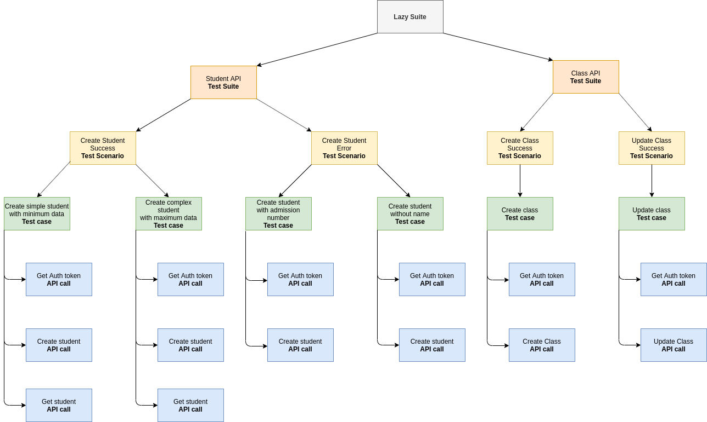
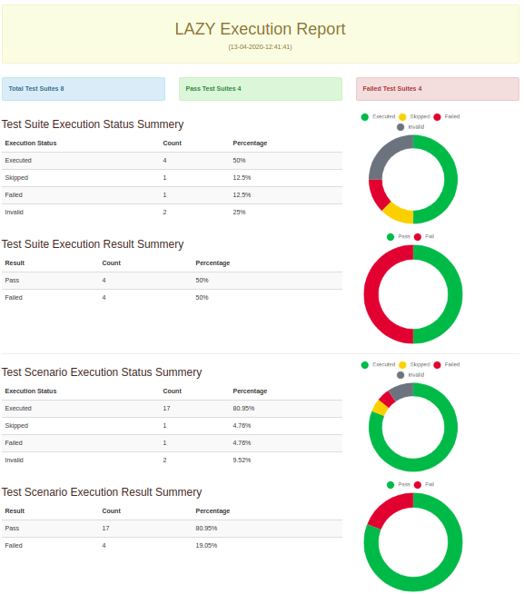
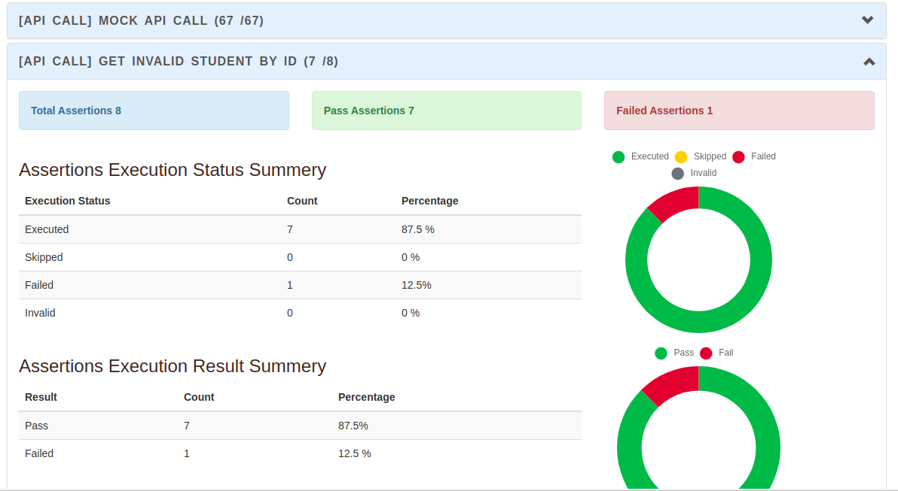
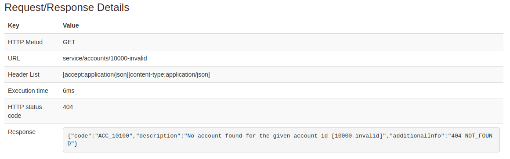
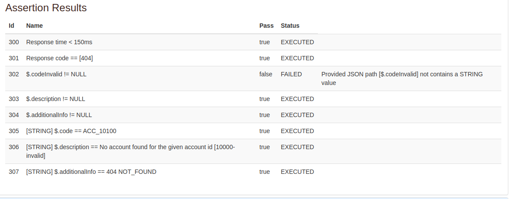

# What is lazy
Lazy is a tool based on meta-modeling to implement API testing. In version 1.0.0 include only java code base API testing framework
. API test suite can be initiated within a few minutes using the lazy framework. 

# Why Lazy is Special from other frameworks
1. Hierarchical approach
2. Motivates for code reusability and modularization
3. Empower with template engine facility
4. Simple configurations and high user friendliness
5. Improve test case implementation efficiency
6. Powerful assertion methods
7. Empower with pre-actions and post-action
8. Powerful environment and global variable defining
9. Enable/disable/override assertion executions within the hierarchical approach
10. Comprehensive result analysis
11. Independent executions
12. Test case grouping and group execution

# Hierarchical approach
This is a main feature that Lazy framework has facilitated. We can create a Lazy suite and we can add multiple test suites to the lazy suite. Then
 we can define multiple test scenarios for each test suites. Then we can define different test cases for each test scenarios. Then we can add any
  number of API calls for each test case. 
  
It starts execution from the lazy suite and it select first test suite. Then it execute that test suite
   by executing first test scenario. Then it select first test case and execute it, then it executes api calls sequentially which are attached to
    that API call. Like wise it executes top to bottom manner. 
    
**The impotency of the above hierarchical manner is we can define any value or action at any level and it will apply for it's sub tree.** 

Please refer the following diagram for the explanation. I'm using very simple student management system to explain the scenarios furthermore. 
 
 
 
Let's assume all APIs are working with HTTPS and host is smile24es.com. Then we can define protocol as HTTPS and host as localhost in the lazy site
 level. Then it will use for all API calls. Like wise let's assume class API context path is class API. Then we can define it on the class-API test
  suite level. Then it will apply only to the class API test suite subtree. Like that we can configure student-api context path on the student api
   test suite. **According to your requirement you can configure values on any level of your lazy suite and it will be automatically apply to it's
    sub tree.** 
   
Let's assume we need to implement a test scenario for assign student to class. Then inside the student API we need to create a class as well. Then
 we have to use different context path to create class. On that scenario can we define student-api context path on the student API test suite level
 ? Yes. **Lazy provide facility to override values at any point.** Then you can change create class API call context path on the API call level. 
 
To provide above functionality lazy framework facilitate something called **stack**. If you configure a value on stack on some level that value will be
 used only to it's sub tree. That value will be removed after complete the execution of that sub tree. Above mentioned values should be configured
  on that stack.
 
## What can define using hierarchical approach
You can configure lot of things with this hierarchical approach. Please refer to the following list to get idea about that. Also please note that
 bold values are provide as default values of those attributes.
1. Protocol - (**http**/Https)
2. Host - (**localhost**/smile24es.com)
3. Port - (**8080**)
4. Context-path - (**lazy-api**/student-api)
5. HTTP method - (**GET**/POST)
6. Header group - (**"accept:application/json"/"content-type:application/json"**)
7. Environment variables as key value pare - (username:lazy-user)
8. Default assertion group (You can configure any assertion with this. Ex: you can assert response time as a default assertion group and identify
 performance issues from the beginning. If you can configure this on top levels your applications will monitor automatically).
 
 Any of above value can be override any of above configured value at any level. Additionally Lazy provides enable/disable facility for default
  assertions. As a example if you need to skip response time assertion for one API call you can configure it very easily.
  
# Motivates for code reusability and modularization
Lazy has based on a hierarchical approach and it contains few layers like lazy suite, test suite, test scenarios, test cases and api calls. We are
 motivate quality engineers to use different packages/modules for each and every layer. Then you can easily manage your test units and you can use
  test units again and again. 
  
As an example, let's assume you have a student-api test suite and class-api test suite. Student api test has contained create student api call and
 create student test case. Like that class api test has contained create class api call and create class test case. Now new feature has introduce
  to your echo system to assign student to a given class. To execute test for the success scenario of that feature, you have to create a class
  , create a student and then assign student to a class. If you adhere to lazy recommendations, you can get the advantage of modularization and
   reusability. Then what you have to do is. You have to create only one api call to assign student to a class. You can re-use create class api-call and create student api-call which are used by create class test
     case and create student test case. To build a test case for that scenario you have to define your test case to assign student to a class. Then
      call create class api call, create student api call and assign student to a class api call accordingly. Now your new test case implementation
       has completed. Now you can assign your new test case to a suitable test scenario. 

# Empower with template engine facility
You have use different different payloads to test different scenarios for a single API call. We have embedded apache freemarker template engine to
 our lazy framework. Then you can use apache freemarker templates to build your request bodies. In simple words you can build only one request body
  template and you can pass different different values for as a map to build different different scenarios. 
  
The apache freemarker has supported for logic based templates also. Since you can build different payloads with one single template. As a example
 let's assume your student api request payload has student basic details and list of classes he/she studies. But that class list is optional
 , then you have to test the same api with class list and without class list. Then we have two types of payloads, one is create student payload
  with class list and create student payload without class list(event without studentClassList key on the request body). To handle that scenario we
   can implement only one apache freemarker template with class list and we can add a very simple if condition on the template to add or remove
    studentClassList attribute based on provided values. It's that simple. you can use conditions loops etc. inside the template. That's why we
     have used apache freemarker to empower lazy framework. 

For references - [https://freemarker.apache.org/]

# Simple configurations and high user friendliness
To start lazy suite you have to create simple spring-boot application with java11 or higher version and need to add just a one maven dependency
. That's how simple lazy is. No big deal to start your work. Also you can enable disable debug logs by single property and you can investigate what
 ever execution details. 
 
Also lazy framework has provided lot of wrapper methods to do your task with one single method. It will gives you a very friendly feeling. 

# Improve test case implementation efficiency
**Lazy has facilitate to define any thing at only one location and use it from anywhere.** You can define api call details (hots, port ect.) at a
 higher level of the hierarchy and you don't need to define those per API call. Also you can define common assertions in the higher level also.  It
  will save a significant time for you to write api call. Also we are supporting for different payload building methods. You can define payload as a
   string, json file and even a template. Then you can write one template for api call and you can pass whatever values you want for different
    scenarios. Then Lazy generates a different payloads based on provided values. Also each unit (API call, test case, test scenario, test suite
    ) are independent components. Then you can assign same unit to multiple parent units. As a example you can use create student api call for any
     number of test cases. even in a class-api test suite. Because of that independent behavior you don't need to repeat any thing. Because of
      those factors lazy will provide high implementation efficiency. 

# Powerful assertion methods
We have provided a separate assertion API. Usually assertion API will contains null/notnull/equals and condition assertions only. Then developer
 has to implement the rest of the things. But with Lazy assertion API we have supported for the large scale of assertion methods. Even for the initial
  release we have provided a set of assertions which exceeds usual assertion API. Assertion API has empowered with JSON path integration. We have
   used this JSON path implementation to provide high usability. [https://github.com/json-path/JsonPath]. 

# Empower with pre-actions and post-action
There are some actions that we need to execute on before or after the api-call. Then we can define actions and we can assign that actions to a api
 call pre action or post action scopes. 

Currently we are improving this feature. For now we are providing action to set global environment variable.

# Powerful environment and global variable defining
User can define global variables and use those variable on other locations. We are working on a new feature to define separate environments
, define environment variables on that defined environment and use those environment variables.

# Enable/disable/override assertion executions within the hierarchical approach
Lazy provide facility to define assertions at any level of the hierarchy as mentioned above. You can define a key for any assertion. Then using
 that key you can enable/disable or override the assertion  on sub tree. Then it will helpful to define more generic assertion set on parent level
  only ones, and you can disable/override if some assertion need to disable/override at lower level. 

# Comprehensive result analysis
We are providing comprehensive result analysis in few ways.
1. Application log file -  We are providing comprehensive user friendly result analysis in the log file even. 
2. HTML report - We are providing result report as HTML based Lazy dashboard
3. JSON file - You can get the result as a JSON file and build your own custom dahsboards 
4. CSV file - you can generate a CSV file with execution results

 
 
  
   
    

Please refer to the HTML sample report -
<a href="http://sample.lazy.smile24es.com/sample-lazy-report.html" onclick="window.open('http://sample.lazy.smile24es.com/sample-lazy-report.html', '_blank');"> http://sample.lazy.smile24es.com/sample-lazy-report.html </a>

# Independent executions
Lazy provides a separate execution API to execute your test suite. It has three main levels/ways you can execute your test suite. 
1. Execute complete suite
2. Execute your suite from a given point (From a given test suite, From a given test scenario,  from a given test case, from a given test case)
3. Define execution groups and execute given group

**If you need to execute just a api-call. we are support for it as well (end option)**. You can execute any unit of test. Let's assume we need to
 execute only a student-creation success test case, then lazy execution api provides facility to execute only that API. In that scenario, please
  note that lazy not using inherited attributes from the parent. As an example if you define some assertion on create student test scenario level
   and if you execute create student test case that test scenario assertion will not be executed. 

# Test case grouping and group execution
We can keep all our test suites in one project. But some times (If we need to do a build verification test) we need not no execute whole thousands of
 tests. we need actually execute only happy paths. To achieve that lazy provides grouping feature. You can add single unit of tests to a one or
  more groups. Then you can execute one or more groups at once using lazy suite executor. It's also follow the hierarchical manner. You have to
   populate LazyExecutionGroup object and pass it to lazy executor to filter test cases. That object structure is like this. 
   
```java
private List<String> testSuiteExecutionGroupNames;
private List<String> testScenarioExecutionGroupNames;
private List<String> testCaseExecutionGroupNames;
private List<String> apiCallExecutionGroupNames;
```
  
You can define a set of test groups to execute on a particular test level. As a example let's assume you need to execute whole class-api test suite
 and need to execute student-class assignment test case. Then you can white list class-api test suite group name at the suite level of executor and
  white list student-class assignment test case group name at the test case level. Then It will execute all tests under the class-api test suite
  . If parent level has white listed it execute all child level tests. Then it start executing student-api test suite. But it executes only student
  -class assignment test case and it's api calls. **Like that lazy provide a simple approach to create your custom executions for different
   requirements.** 


# Ready to use these Features
1. Lazy Language - DSL implementation to improve user friendliness
2. Web UI to create your test suite visually. 
3. Improve test scenario coverage by auto generated test values  
4. Embedded code execution with Lazy


# Why you should trust us?
1. Using cutting edge technologies
2. Comprehensive Java Documentation
3. Modularized implementation with suitable design patterns
4. Well designed extensible and pluggable architecture 
5. More than 80% unit test coverage
6. Standardized with static code analysis
7. Highly extendable with meta-model based design

<Hr>

# How you can start with Lazy?
It's only two steps
1. You have to start spring-boot application with java11 or above. 
2. Then add lazy dependency.


```java
<dependency>
    <groupId>com.smile24es</groupId>
    <artifactId>lazy-core</artifactId>
    <version>1.0.0</version>
</dependency>
```
Please refer to the sample project - <a href="https://github.com/hasithalakmal/lazy-example-1" onclick="window.open('https://github.com/hasithalakmal/lazy-example-1', '_blank');"> https://github.com/hasithalakmal/lazy-example-1 </a> 

# Proposed Project structure
```$xslt
├── pom.xml
├── README.md
└── src
    ├── main
    │   ├── java
    │   │   └── com
    │   │       └── smile24es
    │   │           └── lazy
    │   │               └── sample
    │   │                   ├── SampleLazySuite1.java
    │   │                   ├── suites
    │   │                   │   └── AccountApiTestSuite.java
    │   │                   ├── scenarios
    │   │                   │   └── CreateAccountTestScenario.java
    │   │                   ├── testcase
    │   │                   │   └── CreateAccountSuccessTestCase.java
    │   │                   ├── apicall
    │   │                   │   └── AccountApiCalls.java
    │   │                   └── dto 
    │   │                       └── AccountSetting.java
    │   └── resources
    │       ├── application.properties
    │       ├── logback.xml
    │       └── request-body
    │           └── account-api
    │               ├── create-account
    │               │   └── create-simple-account.json
    │               └── templates
    │                   └── create-account-request-body-template.ftl
    └── test
        ├── java
        │   └── com
        │       └── smile24es
        │           └── lazy
        │               └── sample
        │                   └── LazyManagerTest.java
        └── resources

```
We are suggested to create separate packages for each level of the hierarchy. That modularization will help to manage your project. Also please
 note that this structure has not mandatory.  
 
# How to define a lazy suite?
```$xslt
LazySuite lazySuite = new LazySuite("Lazy Test Suite", lazySuiteStack);
```

# How to define a test suite?
```$xslt
TestSuite testSuite1 = new TestSuite("Student-API test suite");
```

# How to define a test scenario
```$xslt
TestScenario testScenario1 = new TestScenario("Create student with minimum data");
```

# How to define a test case
```$xslt
TestCase testCase1 = new TestCase("Create Account successfully - 1");
```

# How to change stack values
As mentioned under the hierarchical approach explanation, you can configure different attribute values using stack. Let's see how we can configure
 the values using stack. Stack contains three main attributes; those are
    1. Default values
    2. Default Assertion rule list
    3. Global environment
    
Let's consider how to change stack default values. Stack default values contains protocol, hostName, port, contextPath, httpMethod, default
 headerGroup values. Each hierarchy object (Test suite/ Scenario/ Case/ API call) contains stack. We have to get it's stack and it's default value
  object and change whatever value as we wish. As a example let's see how we can change context-path.
 
```java
lazySuite.getStack().getDefaultValues().setContextPath("student-api"); //On lazy suite (root) level
testSuite.getStack().getDefaultValues().setContextPath("student-api"); //On Test suite level
testScenario.getStack().getDefaultValues().setContextPath("student-api"); //On Test scenario level
testCase.getStack().getDefaultValues().setContextPath("student-api"); //On Test case level
apiCall.getStack().getDefaultValues().setContextPath("student-api"); //On Api call level
```

Like that **you can configure values on any level by using that level stack.** 

## 1. configure stack default values
Following example shows how you can change different values for stack default values

```java
DefaultValues defaultValues = testSuite1.getStack().getDefaultValues();
defaultValues.setHttpMethod("https");
defaultValues.setHostName("localhost");
defaultValues.setPort(8080);
defaultValues.setContextPath("student-api");
defaultValues.setHttpMethod("POST");

HeaderGroup headerGroup = new HeaderGroup("Sample header group");
Header header1 = new Header("Accept Header", "accept", "application/json");
Header header2 = new Header("Content type Header", "content-type", "application/json");
headerGroup.getHeaders().add(header1);
headerGroup.getHeaders().add(header2);
defaultValues.setHeaderGroup(headerGroup);

```

## 2. configure stack default assertion rule list
Following example shows how you can define default  assertion rule list in the stack

```java
AssertionRuleGroup defaultCreateAssertionGroup = new AssertionRuleGroup("Test scenario assertion group");
List<AssertionRule> assertionRules = defaultCreateAssertionGroup.getAssertionRules();
assertionRules.add(Assert.responseTimeAssertionGreaterThanGivenMilliSeconds("2000"));
assertionRules.add(Assert.responseCodeAssertion("201"));
assertionRules.add(Assert.responseBodyNotNull());
testScenario1.getStack().addDefaultAssertionGroup(defaultCreateAssertionGroup);
```


## 3. configure stack global values
This feature is still under development

# Link the Dots (How to build a lazy test suite)
## Define API Call
```java
public class AccountApiCall {

    public static ApiCall getAccountApiCall() {
        ApiCall apiCall2 = new ApiCall("Get Account by Id");
        apiCall2.setUri("service/accounts/1000");
        apiCall2.addAssertionRule(Assert.responseCodeAssertion("200"));
        apiCall2.addAssertionRule(Assert.notNullBodyValueAssertion("$['accountName']"));
        apiCall2.addAssertionRule(Assert.equalBodyValueAssertion("$['accountId']", "1000"));
        apiCall2.addAssertionRule(Assert.equalBodyValueAssertion("$['accountName']", "Lazy Account"));
        return apiCall2;
    }
}
```
## Define Test case and attach api call to test case
```java
public class GetAccountTestCases {

    public static TestCase getCreateAccountTestCase() throws LazyCoreException {
        TestCase testCase1 = new TestCase("Create Account successfully - 1");
        testCase1.getApiCalls().add(AccountApiCall.getAccountApiCall());
        return testCase1;
    }
}
```

## Define Test scenario and attach test case to test scenario
````java
public class GetAccountTestScenarios {

    public static TestScenario getAccountTestScenario() throws LazyCoreException {
        TestScenario testScenario1 = new TestScenario("get Account");
        testScenario1.getTestCases().add(GetAccountTestCases.getCreateAccountTestCase());
        return testScenario1;
    }
}
````

## Define Test suite and attach test scenario to test suite
```java
public class AccountTestSuite {

    public static com.smile24es.lazy.beans.suite.TestSuite getAccountApiTestSuite() throws LazyCoreException {
        TestSuite testSuite1 = new TestSuite("Account Test Suite");
        testSuite1.getStack().getDefaultValues().setContextPath("account-api"); //We are configuring context path
        testSuite1.getTestScenarios().add(GetAccountTestScenarios.getAccountTestScenario());
        return testSuite1;
    }
}
```

## Define Lazy suite and attach test suites to lazy suite
```java
public class SmileLazySuite {
    public static LazySuite populateSampleLazySuite() throws LazyCoreException {
        LazySuite lazySuite = new LazySuite("Sample lazy suite");
        lazySuite.getTestSuites().add(AccountTestSuite.getAccountApiTestSuite());
        return lazySuite;
    }
}
```

**Recommend to do all above implementations under the src directory and enable logs.**

## Execute test suite
**Define Test class to execute under the test directory**
```java
@SpringBootTest(classes = LazyApplication.class)
public class Sample0Executor {

    @Autowired
    private Executor executor;

    @Test
    public void executeSampleLazySuite() {
        try {
            LazyExecutionData results = executor.executeLazySuite(SmileLazySuite0.populateSampleLazySuite());
            Assert.assertNotNull(results);
        } catch (Exception ex) {
            Assert.fail("Success scenarios should not be failed", ex);
        }
    }
}
```

## Execute and view log file
When you execute your lazy suite, you can get a comprehensive log about the test execution. 
```less
2020-04-07 01:30:49,970 INFO com.smile24es.lazy.suite.sample0.Sample0Executor [main] Starting Sample0Executor on Sysco with PID 29443 (started by hasithag in /home/hasithag/Hasitha/Personal/GIT/lazy/core)
2020-04-07 01:30:49,982 INFO com.smile24es.lazy.suite.sample0.Sample0Executor [main] No active profile set, falling back to default profiles: default
2020-04-07 01:30:51,926 INFO com.smile24es.lazy.suite.sample0.Sample0Executor [main] Started Sample0Executor in 2.746 seconds (JVM running for 4.432)
2020-04-07 01:30:52,210 INFO com.smile24es.lazy.manager.impl.LazyManagerImpl [main] Ready to execute lazy suite - [Sample lazy suite]
2020-04-07 01:30:52,240 INFO com.smile24es.lazy.manager.impl.TestSuiteManagerImpl [main] Ready to execute test suite - [1] - [Account Test Suite]
2020-04-07 01:30:52,245 INFO com.smile24es.lazy.manager.impl.TestScenarioManagerImpl [main] Executing test scenario - [1] - [get Account]
2020-04-07 01:30:52,248 INFO com.smile24es.lazy.manager.impl.TestCaseManagerImpl [main] Executing test case - [1] - [Create Account successfully - 1]
2020-04-07 01:30:52,251 INFO com.smile24es.lazy.manager.impl.ApiCallManagerImpl [main] Executing api call - [1] - [Get Account by Id]
2020-04-07 01:30:52,495 INFO com.smile24es.lazy.manager.handlers.ApiCallHandlerImpl [main] 

----------------------------------------------------------------- 
Executing api call [1] - [Get Account by Id] 
----------------------------------------------------------------- 
Http Method         : [GET]
Request URL         : [http://localhost:8080/account-api/service/accounts/1000]
Header List         :
                     - [accept:application/json]
                     - [content-type:application/json]
-----------------------------------------------------------------
Execution time      : [33] milli seconds
HTTP status code    : [200]
Response            : [{"status":"ACTIVE","createdBy":"12345","createdTimestamp":1586112248464,"updatedTimestamp":0,"accountId":"1000","parentId":"1","enterpriseId":"1","accountName":"Sathara-1577641690","ownerName":"Hasitha-1577641690","versionId":"1.0.0","addresses":[],"settings":[]}]
-----------------------------------------------------------------


2020-04-07 01:30:52,495 INFO com.smile24es.lazy.manager.impl.ApiCallManagerImpl [main] Executed api call - [1] - [Get Account by Id]
2020-04-07 01:30:52,531 INFO com.smile24es.lazy.manager.impl.ApiCallManagerImpl [main] Completed execution of api call - [1] - [Get Account by Id]
2020-04-07 01:30:52,531 INFO com.smile24es.lazy.manager.impl.TestCaseManagerImpl [main] Executed test case - [1] - [Create Account successfully - 1]
2020-04-07 01:30:52,531 INFO com.smile24es.lazy.manager.impl.TestCaseManagerImpl [main] Executed all test cases...
2020-04-07 01:30:52,531 INFO com.smile24es.lazy.manager.impl.TestScenarioManagerImpl [main] Executed test scenario - [1] - [get Account]
2020-04-07 01:30:52,531 INFO com.smile24es.lazy.manager.impl.TestSuiteManagerImpl [main] Executed test suite - [1] - [Account Test Suite]
2020-04-07 01:30:52,531 INFO com.smile24es.lazy.manager.impl.LazyManagerImpl [main] Executed lazy suite - [Sample lazy suite]
2020-04-07 01:30:52,538 INFO com.smile24es.lazy.manager.impl.LazyBaseManager [main] 
+-----------+-------------------+---------------------------------------------------------------+------------------+---------+
| Result Id | API Call Name     | Assertion Name                                                | Execution Status | Is Pass |
+-----------+-------------------+---------------------------------------------------------------+------------------+---------+
| 1         | Get Account by Id | Response code assertion for - [200]                           | EXECUTED         | true    |
| 2         | Get Account by Id | Body value not null assertion                                 | EXECUTED         | true    |
| 3         | Get Account by Id | Response body value assertion $['accountId'] = 100001         | EXECUTED         | false   |
| 4         | Get Account by Id | Response body value assertion $['accountName'] = Lazy Account | EXECUTED         | false   |
+-----------+-------------------+---------------------------------------------------------------+------------------+---------+

```

# Assert API
Lazy Assert API provides a rich set of assertion methods that you can use for your assertions. This is about It's main assertion methods. Please
 note that we have introduce overloaded method for each assertion method to define assertion name.

Assertion Method     | Description
--- | ---
responseBodyNotNull() | Response body not null assertion
responseBodyNotNull(String assertionName) | Response body not null assertion (overloaded method with name)
nullValue(String jsonPath)  | Response body attribute null value
nullValue(String assertionName, String jsonPath) | Response body attribute null value
notNull(String jsonPath) | Response body attribute not null
notNull(String assertionName, String jsonPath) | Response body attribute not null
isKeyAvailable(String jsonPath) | Response body attribute existence
isKeyAvailable(String assertionName, String jsonPath) | Response body attribute existence
isKeyUnavailable(String jsonPath)   | Response body attribute not existence
isKeyUnavailable(String assertionName, String jsonPath) | Response body attribute not existence
equal(String jsonPath, String value) | Response body attribute equal
equal(String assertionName, String jsonPath, String value) | Response body attribute equal
equal(String jsonPath, Integer value)   | Response body attribute equal
equal(String assertionName, String jsonPath, Integer value) | Response body attribute equal
equal(String jsonPath, Double value) | Response body attribute equal
equal(String assertionName, String jsonPath, Double value) | Response body attribute equal
equal(String jsonPath, Boolean value) | Response body attribute equal
equal(String assertionName, String jsonPath, Boolean value) | Response body attribute equal
notEqual(String jsonPath, String value) | Response body attribute not equal
notEqual(String assertionName, String jsonPath, String value) | Response body attribute not equal
notEqual(String jsonPath, Integer value) | Response body attribute not equal
notEqual(String assertionName, String jsonPath, Integer value)  | Response body attribute not equal
notEqual(String jsonPath, Double value) | Response body attribute not equal
notEqual(String assertionName, String jsonPath, Double value) | Response body attribute not equal
notEqual(String jsonPath, Boolean value) |  Response body attribute not equal
notEqual(String assertionName, String jsonPath, Boolean value) |  Response body attribute not equal
greaterThan(String jsonPath, String value)  | Response body attribute value comparison
greaterThan(String assertionName, String jsonPath, String value) | Response body attribute value comparison
greaterThan(String jsonPath, Integer value) | Response body attribute value comparison
greaterThan(String assertionName, String jsonPath, Integer value) | Response body attribute value comparison
greaterThan(String jsonPath, Double value) | Response body attribute value comparison
greaterThan(String assertionName, String jsonPath, Double value)  | Response body attribute value comparison
greaterThanOrEqual(String jsonPath, String value) | Response body attribute value comparison
greaterThanOrEqual(String assertionName, String jsonPath, String value) | Response body attribute value comparison
greaterThanOrEqual(String jsonPath, Integer value) | Response body attribute value comparison
greaterThanOrEqual(String assertionName, String jsonPath, Integer value)  | Response body attribute value comparison
greaterThanOrEqual(String jsonPath, Double value) | Response body attribute value comparison
greaterThanOrEqual(String assertionName, String jsonPath, Double value) | Response body attribute value comparison
lessThan(String jsonPath, String value) | Response body attribute value comparison
lessThan(String assertionName, String jsonPath, String value) | Response body attribute value comparison
lessThan(String jsonPath, Integer value) | Response body attribute value comparison
lessThan(String assertionName, String jsonPath, Integer value) | Response body attribute value comparison
lessThan(String jsonPath, Double value) | Response body attribute value comparison
lessThan(String assertionName, String jsonPath, Double value) | Response body attribute value comparison
lessThanOrEqual(String jsonPath, String value) |  Response body attribute value comparison
lessThanOrEqual(String assertionName, String jsonPath, String value) | Response body attribute value comparison
lessThanOrEqual(String jsonPath, Integer value) | Response body attribute value comparison
lessThanOrEqual(String assertionName, String jsonPath, Integer value) | Response body attribute value comparison
lessThanOrEqual(String jsonPath, Double value) | Response body attribute value comparison
lessThanOrEqual(String assertionName, String jsonPath, Double value) | Response body attribute value comparison
between(String jsonPath, String value1, String value2) | Response body attribute value comparison
between(String assertionName, String jsonPath, String value1, String value2) | Response body attribute value comparison
between(String jsonPath, Integer value1, Integer value2) | Response body attribute value comparison
between(String assertionName, String jsonPath, Integer value1, Integer value2) | Response body attribute value comparison
between(String jsonPath, Double value1, Double value2) | Response body attribute value comparison
between(String assertionName, String jsonPath, Double value1, Double value2) | Response body attribute value comparison
contains(String jsonPath, String value) |  Response body attribute value contains
contains(String assertionName, String jsonPath, String value) | Response body attribute value contains
notContains(String jsonPath, String value) | Response body attribute value not contains
notContains(String assertionName, String jsonPath, String value) | Response body attribute value not contains
containsExactly(String jsonPath, List values) | Response body attribute value list exact match with provided value list
containsExactly(String assertionName, String jsonPath, List values) |  Response body attribute value list exact match with provided value list
containsAll(String jsonPath, List values) |  Response body attribute value list contains match with all provided value list. Additional values will contains in the response body attribute value list. 
containsAll(String assertionName, String jsonPath, List values) | Response body attribute value list contains match with all provided value list. Additional values will contains in the response body attribute value list.
containsAny(String jsonPath, List values)  | Response body attribute value list contains at lease one provided value. 
containsAny(String assertionName, String jsonPath, List values) | Response body attribute value list contains at lease one provided value. 
responseTimeLessThan(String time) | Response time assertion
responseTimeLessThan(String assertionName, String time) | Response time assertion
responseTimeLessThanOrEqual(String time) | Response time assertion
responseTimeLessThanOrEqual(String assertionName, String time) | Response time assertion
responseTimeGreaterThan(String time) |Response time assertion
responseTimeGreaterThan(String assertionName, String time)  | Response time assertion
responseTimeGreaterThanOrEqual(String time)  | Response time assertion
responseTimeGreaterThanOrEqual(String assertionName, String time) | Response time assertion
responseCodeEqual(Integer code) | Response code assertion
responseCodeEqual(String assertionName, Integer code) | Response code assertion
responseCodeNotEqual(Integer code) | Response code assertion
responseCodeNotEqual(String assertionName, Integer code) | Response code assertion
responseCodeLessThan(Integer code) | Response code assertion
responseCodeLessThan(String assertionName, Integer code) | Response code assertion
responseCodeLessThanOrEqual(Integer code) | Response code assertion
responseCodeLessThanOrEqual(String assertionName, Integer code) | Response code assertion
responseCodeGreaterThan(Integer code) | Response code assertion
responseCodeGreaterThanOrEqual(Integer code) | Response code assertion
responseCodeGreaterThanOrEqual(String assertionName, Integer code) | Response code assertion
responseCodeBetween(Integer code1, Integer code2) | Response code assertion
responseCodeBetween(String assertionName, Integer code1, Integer code2) | Response code assertion

We have used JSON path to provide very powerful and easy way to write assertions. Please refer JSON path documentation [https://github.com/json-path
/JsonPath]. You can validate your JSON path with this [http://jsonpath.herokuapp.com/]. 

This is the sample JSON response and valid JSON path based assertions for your references. 
```json
{
  "accountId": 1,
  "accountName": "Smile24",
  "isActive": true,
  "monthlyCharge": 10.75,
  "phone": {
    "number": "12345678"
  },
  "settings": [
    {
      "id": 840,
      "key": "payment.period",
      "value": "monthly",
      "isActive": true,
      "chargeForFeature": 11.9
    },
    {
      "id": 841,
      "key": "payment.method",
      "value": "direct",
      "isActive": true,
      "chargeForFeature": 12.86,
      "supportedMethods": [
        {
          "type": "Card",
          "minValue": 1
        },
        {
          "type": "Cash",
          "allowd": [
            "SLR",
            "USD"
          ]
        }
      ]
    }
  ]
}
```

Please refer to the following assertion rule example to experience the beauty and power of the Lazy Assertion API. 
```java
Assert.responseCodeEqual(200);

//Null/Not Null assertions
Assert.notNull("$.accountId");
Assert.notNull("$.accountName");
Assert.notNull("$.isActive");
Assert.notNull("$.monthlyCharge");
Assert.notNull("$.phone");
Assert.notNull("$.phone.number");
Assert.notNull("$.settings");
Assert.notNull("$.settings[0].id");
Assert.notNull("$.settings[0].key");
Assert.notNull("$.settings[0].value");
Assert.notNull("$.settings[0].isActive");
Assert.notNull("$.settings[0].chargeForFeature");
Assert.notNull("$.settings[1].id");
Assert.notNull("$.settings[1].key");
Assert.notNull("$.settings[1].value");
Assert.notNull("$.settings[1].isActive");
Assert.notNull("$.settings[1].chargeForFeature");
Assert.notNull("$.settings[1].supportedMethods");
Assert.notNull("$.settings[1].supportedMethods[0].type");
Assert.notNull("$.settings[1].supportedMethods[0].minValue");
Assert.notNull("$.settings[1].supportedMethods[1].type");
Assert.notNull("$.settings[1].supportedMethods[1].allowed");

Assert.isKeyAvailable("$.accountName");
Assert.isKeyUnavailable("$.invalidKey");

//Equal assertions
Assert.equal("$.accountId", 1);
Assert.equal("$.accountName", "Smile24");
Assert.equal("$.isActive", true);
Assert.equal("$.monthlyCharge", 10.75);
Assert.equal("$.phone.number", "12345678");
Assert.equal("$.settings[0].id", 840);
Assert.equal("$.settings[0].key", "payment.period");
Assert.equal("$.settings[0].value", "monthly");
Assert.equal("$.settings[0].isActive", true);
Assert.equal("$.settings[0].chargeForFeature", 11.9);
Assert.equal("$.settings[1].id", 841);
Assert.equal("$.settings[1].key", "payment.method");
Assert.equal("$.settings[1].value", "direct");
Assert.equal("$.settings[1].isActive", true);
Assert.equal("$.settings[1].chargeForFeature", 12.86);
Assert.equal("$.settings[1].supportedMethods[0].type", "Card");
Assert.equal("$.settings[1].supportedMethods[0].minValue", 1);
Assert.equal("$.settings[1].supportedMethods[1].type", "Cash");

//String operations
Assert.contains("$.accountName", "Smile");
Assert.notContains("$.accountName", "Lazy");


//Max min - numeric logic
Assert.greaterThan("$.monthlyCharge", 10.00);
Assert.lessThan("$.monthlyCharge", 11.00);
Assert.greaterThanOrEqual("$.monthlyCharge", 10.75);
Assert.lessThanOrEqual("$.monthlyCharge", 10.75);
Assert.between("$.monthlyCharge", 10.00, 11.00);

//List related logic
Assert.containsExactly("$.settings[*].key", Arrays.asList("payment.period", "payment.method"));
Assert.containsExactly("$.settings[*].id", Arrays.asList(840, 841));
Assert.containsExactly("$.settings[*].chargeForFeature", Arrays.asList(11.9, 12.86));
Assert.containsExactly("$.settings[*].isActive", Arrays.asList(true, true));

Assert.containsAll("$.settings[*].key", Arrays.asList("payment.period"));
Assert.containsAll("$.settings[*].id", Arrays.asList(840));
Assert.containsAll("$.settings[*].chargeForFeature", Arrays.asList(11.9));
Assert.containsAll("$.settings[*].isActive", Arrays.asList(true));

Assert.containsAny("$.settings[*].key", Arrays.asList("payment.period", "INVALID"));
Assert.containsAny("$.settings[*].id", Arrays.asList(840, 1000));
Assert.containsAny("$.settings[*].chargeForFeature", Arrays.asList(11.9, 1000));
Assert.containsAny("$.settings[*].isActive", Arrays.asList(true, false));

//Advanced list related logic
Assert.containsExactly("$.settings[?(@.key=='payment.period')].value", Arrays.asList("monthly"));
Assert.containsExactly("$.settings[?(@.supportedMethods)].id", Arrays.asList(841));
Assert.containsExactly("$.settings[?(@.supportedMethods)].supportedMethods.[?(@.type == 'Card')].minValue", Arrays.asList(1));
Assert.containsExactly("$.settings[?(@.supportedMethods)].supportedMethods.[?(@.type == 'Cash')].allowed[*]", Arrays.asList("SLR", "USD"));

```
Lazy API has supported very large range of assertions with single method call. 

# Action API
Lazy Action API provides some pre define actions you can execute before or after API call execution. API call supports for pre and post actions
. However the action method is common. But action API is common. You can define whatever action from Action API and you can assign that action to
 API call's pre-action attribute or post action attribute. 
 
 Action     | Support for | Description
 --- | --- | ---
createGlobalVariableFromResponseBody(String key, String jsonPath) | Post actions |You can define a global variable and set value from response body. You can use JSON path to select value

This is the only existing Actions for now. We will be improving this section with the next releases. 


# Executor API
Lazy Action API provides an interface to execute your test suite

 Executor | Description
 --- | --- 
 executeLazySuite(LazySuite lazySuite) | Execute complete lazy suite
 executeLazySuite(LazySuite lazySuite, LazyExecutionGroup lazyExecutionGroup) | Execute pre defined group of tests. You have to define test groups in LazyExecutionGroup. Then it will execute the suite by considering the hierarchical approach
 executeTestSuite(TestSuite testSuite, Stack stack) | Execute given test suite. In here it not inheriting any attribute from the parent. since you have to define stack.
executeTestScenario(TestScenario testScenario, Stack stack) | Execute given test scenario. In here it not inheriting any attribute from the parent. since you have to define stack.
executeTestCase(TestCase testCase, Stack stack) | Execute given test case. In here it not inheriting any attribute from the parent. since you have to define stack.
executeApiCall(ApiCall apiCall, Stack stack) | Execute given api call. In here it not inheriting any attribute from the parent. since you have to define stack.

# Sample Projects
You can use <a href="https://github.com/hasithalakmal/lazy-example-1" onclick="window.open('https://github.com/hasithalakmal/lazy-example-1', '_blank');"> https://github.com/hasithalakmal/lazy-example-1 </a> this sample implementation for your references. Currently it contains three samples.

Sample0 - Assertion explanation
Sample1 - Explain project structure and basic features
Sample2 - Advance feature examples

To execute that suite you can use -  <a href="https://github.com/hasithalakmal/lazy-mock-api" onclick="window.open('https://github.com/hasithalakmal/lazy-mock-api', '_blank');"> https://github.com/hasithalakmal/lazy-mock-api </a> project. 

These code bases will be improve 

# Versioning & Releases
We are using three digit version number. First digit represent a major release. Second digit represents a feature. Last digit represents a bug fix
 or minor improvements. 

Lazy version one **(1.0.0)** has released on 2020-04-14 as a beta release. We are warmly welcome all developers/quality engineers and all of you to
 Lazy. There are so many things to improve on version 1.0.0 and we are on it. We are encouraging you to try Lazy and provide some feedback to
  improve our framework. Also our next releases will align with your feedback. 
  
## Next Release I
### Date 
`2020 Aug`
### Type
This will be the first major release of Lazy
### Features
1. Improve coding standards
2. Unit test coverage
3. Minor feature improvements
4. Improve test scenario coverage by auto generated test values  
5. Embedded code execution with Lazy
6. DSL Implementation

## Next Release II
### Date 
`2021 Jan`
### Type
This will be the second major release of Lazy
### Features
1. Lazy UI to create and build your test cases